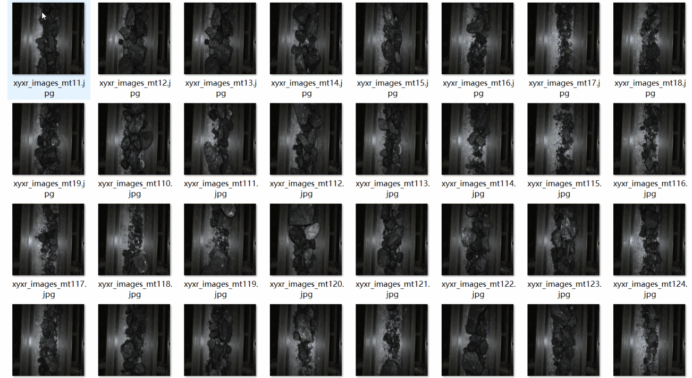
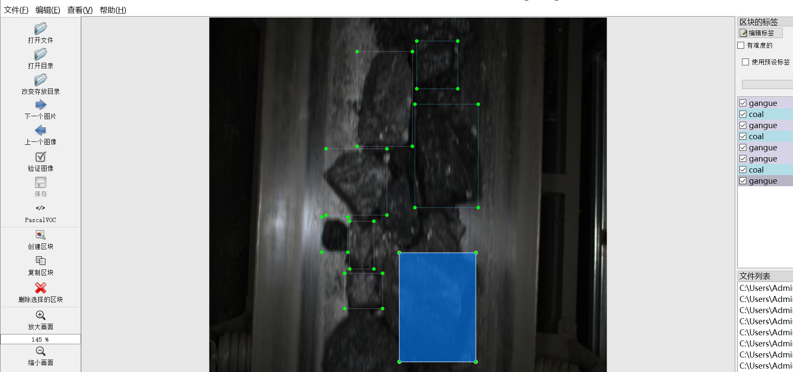
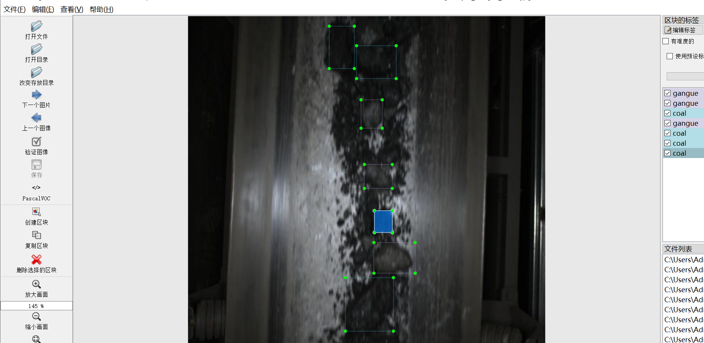
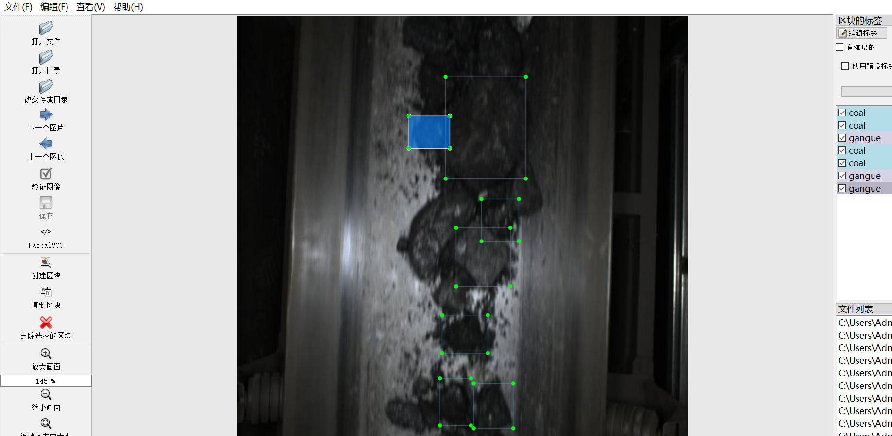

# [Object Detection] Conveyor Belt on Coal 、 Coal gangue 、 Ganglion Detection Dataset 7341 imagesYOLO+VOC

【Target Detection】7341 Dataset of Coal, Coal Gangue, and Ore on the conveyor belt, including YOLO+VOC

Dataset Format: VOC format + YOLO format

The compressed file contains: three folders, each storing images, xml files, and text files.

Total jpg images in JPEGImages folder: 7341

Total number of XML files in the Annotations folder: 7341

The total number of txt files in the labels folder is 7341.

Number of tag types: 3

Tag names: ["Coal-gangue","coal","gangue"]

The number of boxes for each label (Note that the order of labels in the Yolo format does not correspond to this, but is based on the classes.txt file in the labels folder):

Coal-gangue frame count = 2

coal frame count = 26792

gangue frame count = 25498

Total boxes: 52292

Picture clarity (Resolution: Pixels): Clear

Is the image enhanced: No

Shape of the label: Rectangular box, used for object detection and recognition.

Dataset Type ：199m

Special Notice: This dataset does not guarantee the accuracy or precision of the trained models or weight files. The dataset only provides accurate and reasonable annotations.

Annotations

Picture overview

## Images

---

Here is a pay link on Stripe (https://buy.stripe.com/3cs8yP7sY87d0vu9AB). Please contact me lonlonago@foxmail.com after funding $89, and I will send you a complete data files, thank you!

